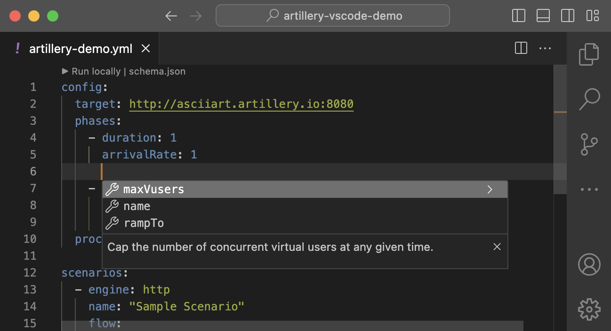
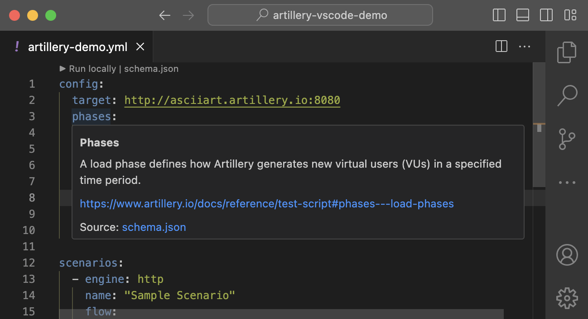

# Artillery for VS Code

The [Artillery](https://www.artillery.io/) extension for VS Code adds IntelliSense with autocomplete and validation for Artillery test scripts, inline documentation, and the ability to run a load test directly from VS Code.

## Installation

Install the extension from [Visual Studio Marketplace](https://marketplace.visualstudio.com/items?itemName=Artilleryio.vscode-artillery).

## Features

### Autocomplete

Write scripts faster and avoid mistakes with autocomplete for Artillery test scripts.

Press <kbd>Control+Space</kbd> to show all available autocomplete options.



### Inline documentation

Hover over configuration options in your script to get a short description and a link to extended documentation for it.



### Run test from VS Code

Click **▶ Run locally** at the top of the file to run the test script. This opens a new terminal inside VS Code and executes `artillery run` on the current script.

You can also open the Command Palette with <kbd>Control+Shift+P</kbd> (or `Command+Shift+P` on MacOS) and choose **Run load test locally** command.

> [!NOTE]
> This command executes `artillery run` on the script with no other arguments. If you need to use additional command-line flags, you will need to run `artillery` directly from a terminal.

## Configuration

### `include: Array<string>`

- Default: `[]`

A list of absolute file URIs or glob patterns to always treat as Artillery test scripts.

```json
{
  "artillery.include": ["file:///User/john/Projects/acme/load-tests/**/*.yml"]
}
```

### `exclude: Array<string>`

- Default: `[]`

A list of absolute file URIs or glob patterns to ignore. The extension will not activate for the ignored files.

```json
{
  "artillery.exclude": ["**/*.conf.yml"]
}
```
